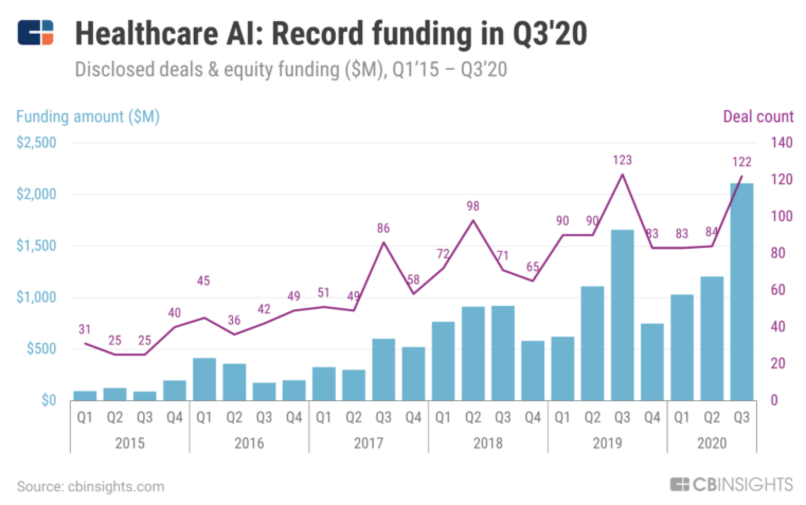
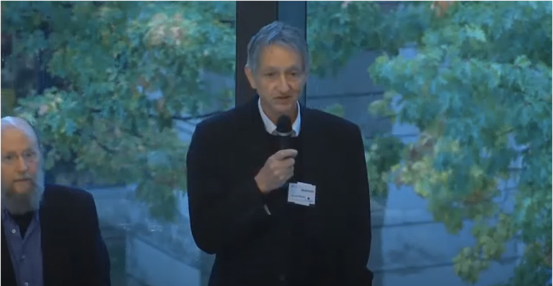
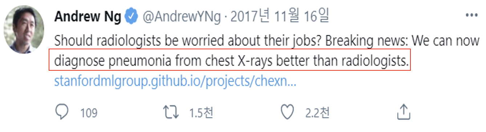
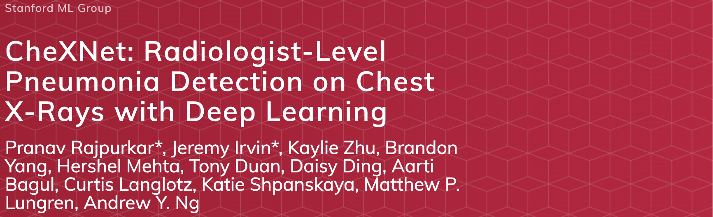
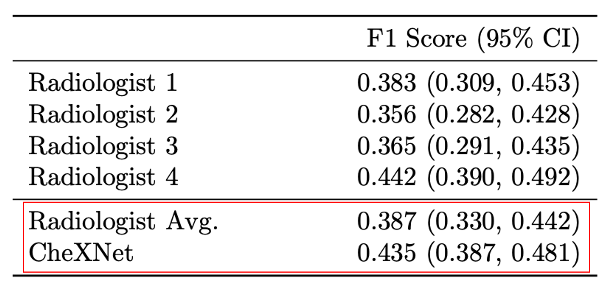
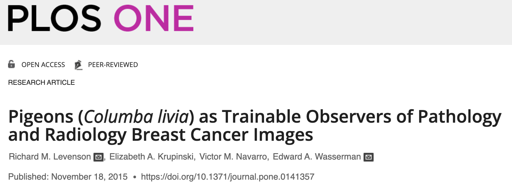
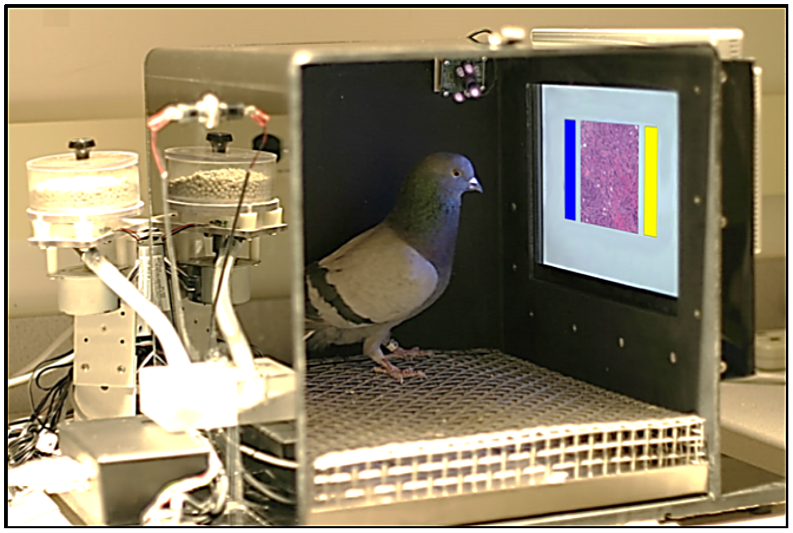

# 의료인공지능에 대한 개괄적 소개와 의료인공지능 사업에 대한 이해

# 들어가며

인공지능 산업계의 큰 분야를 몇 가지로 나누라면 자율주행, 로보틱스, 그리고 꼭 빠질 수 없는 것이 의료인공지능입니다. 의료인공지능 산업계는 인공지능이 급부상한 이후 지난 10년간 폭발적으로 성장했습니다. 일례로 cbinsight라는 곳에서 조사한 [자료](https://www.cbinsights.com/research-healthcare-ai-trends-2020?utm_campaign=ai-healthcare-trends_2018-09&utm_content=google-prospecting-healthcare&campaignid=17130804447&adgroupid=137057131155&utm_term=healthcare%20ai&utm_source=google&utm_medium=cpc&hsa_tgt=kwd-305671546055&hsa_grp=137057131155&hsa_src=g&hsa_net=adwords&hsa_mt=p&hsa_ver=3&hsa_ad=595963279194&hsa_acc=5728918340&hsa_kw=healthcare%20ai&hsa_cam=17130804447&gclid=CjwKCAiA68ebBhB-EiwALVC-NhAguXT08J5pViCgI46MO4Q0jQjW7suPGMc1t0bA3ZYIUOb5uHvi8xoCaR4QAvD_BwE)에 따르면

의료인공지능에 대한 투자는 크게 성장하고 있는 추세이고 기술들도 포화에 가까울 정도로 수많은 연구들이 수많은 주제에 대해 진행되고 있습니다. 이렇게 부상하고 있는 의료인공지능은 얼마나 발전했고, 무엇이 허들이며 실제 의료를 바꾸기 위해 해야 하는 고민들은 무엇일까요?

이 글에서는 의료인공지능에 대한 발전을 개략적으로 살펴보고 기술과 한국의 의료인공지능 산업계에 대한 이해를 하는 것을 목표로 삼아 봅니다.

## 의료인공지능, 그리고 의사의 미래

의료인공지능 연구를 시작하면서 제가 의사, 의대생들에게 많이 들었던 말은 

> 그거 상용화되면 의사 망하는거 아님?
> 

이었습니다. 의사는 정말 의료인공지능으로 인해서 일자리가 위협받게 될까요? 다음 질문을 생각해봅시다.

> (의료)인공지능은 도메인 전문가(의사)를 대체할 수 있을까?
> 

### 의료인공지능은 의사를 대체할 수 있을까?

사람마다 의견이 갈릴것 같습니다. 먼저 대가들은 어떻게 생각하는지 살펴봅시다. 먼저 살펴볼 대가는 딥러닝의 대부, 제프리 힌튼입니다.

Machine Learning and Markets for Intelligence, 2016

제프리 힌튼은 2016년 Machine Learning and Markets for Intelligence라는 곳에서 다음과 같이 말했습니다. ([유튜브 링크](https://www.youtube.com/watch?v=2HMPRXstSvQ))

> Let me start by saying a few things that seem obvious. I think if you work as a radiologist, you’re like the coyote that’s already over the edge of the cliff but hasn’t yet looked down, so doesn’t know there’s no ground underneath him. People should stop training radiologists now. It’s just completely obvious that within 5 years, deep learning is going to do better than radiologists, because it’s going to be able to get a lot more experience. It might be 10 years, but we’ve got plenty of radiologists already.
> 

한글로 번역하면 다음 정도의 말이 되겠죠.

> 명백하게 보이는 몇 가지 얘기부터 하겠습니다. 만약 당신이 영상의학과 의사로 일한다면, 당신은 벼랑 끝에 서있지만 아직 아래를 내려보지 않아서 바로 앞에 땅이 없다는 사실을 모르는 코요테와 같습니다. 영상의학과 의사를 훈련하는 것을 우리는 멈추어야 합니다. 명백한 사실은 5년 안에, 딥러닝은 영상의학과 의사보다 더 잘 할 것이고, 이는 딥러닝이 더 많은 경험을 할 것이기 때문입니다. 10년이 될 수도 있지만, 영상의학과 의사들의 수는 충분합니다.
> 

짧으면 5년, 길면 10년 내에 영상의학과가 딥러닝, 인공지능으로 대체될 것이라는 이야기를 하고 있습니다. 다른 대가의 의견도 살펴봅시다. 이번에 살펴볼 사람은 Coursera의 Machine Learning 강의로 유명한 스탠포드의 앤드류 응 교수님입니다.

앤드류 응 교수님은 영상의학과보다 흉부 X선 사진에서 폐렴을 인공지능이 더 잘 진단할 수 있다고 무려 2017년에 말씀하셨군요. 저 트윗 아래의 [링크](https://stanfordmlgroup.github.io/projects/chexnet/)에 들어가면 다음과 같은 페이지가 나옵니다.

이 페이지에 링크된 논문으로 들어가면 다음과 같은 주장을 하는 것을 볼 수 있습니다.

F1 Score가 뭔지는 모르겠지만, Radiologist(영상의학과 전문의)보다 CheXNet이 더 성능이 높다는 것은 알 수 있을거 같습니다. 그러니까, 영상의학과 전문의보다 딥러닝이 더 잘한다는 말 정도를 하는것 같네요. 무려 2017년에!

여기서 잠시 생각을 해 보겠습니다. 폐렴이라는 질환은 다른 말로 하면 하기도감염이 됩니다. 즉, 기도의 아랫쪽에 감염이 생긴다는 말이지요. (대비되는 말은 상기도감염, 혹은 감기가 됩니다.) 그런데 폐렴은 몰라도 감기는 다들 한 번쯤 걸려보셨을 것이기 때문에 그 당시를 생각해보면, 우리가 감기에 걸린다고 아주 돈이 비싸거나 무거운 장비로 검사를 하지는 않았습니다. 폐렴도 아주 같지는 않지만 아주 다르지도 않습니다. 환자가 기침을 하고, 가래가 끓고, 열이 나고, 폐렴이 의심되면

1. 일단 (광범위) 항생제를 쓰고
2. PCR, 세균 배양, 항원검사법 등을 통해 원인 균을 파악하며 (이를 통해 균주에 맞는 적절한 항생제로 치료 방침을 변경하기도 합니다.)
3. 보조적인 수단으로 흉부 X선 검사나 흉부 CT를 찍습니다.

그러면 여기서 앤드류 응 교수님 그룹이 한 연구는 이 중 무엇에 대해서 연구를 한 것일까요? 바로 진단의 gold standard가 아닌 흉부 X선 검사와 흉부 CT에 대해서, 그 중에서도 정확도가 CT에 비해서 낮은 흉부 X선 검사에 대해 영상의학과 의사보다 잘 한다는 것을 보인 연구입니다. 요약하자면, 보조적인 진단 수단 중에서도 정확도가 상대적으로 떨어지는 수단에 대해 전문가 그룹보다 잘 한다는 것을 주장한 것이지요.

### 질문 바꿔보기

이런 대가들의 의견을 바탕만으로 결론을 내리기 전에 논문을 한 편 살펴봅시다. ([링크](https://pubmed.ncbi.nlm.nih.gov/26581091/))

논문 제목이 자극적입니다. 우리 말로 번역하자면 [유방암의 영상의학, 병리 이미지에 대한 비둘기의 학습 능력] 정도로 의역할 수 있겠네요. 잘 아는 사실이지만, 의학 지식은 획득하기가 어렵습니다. 의대를 졸업하고, 인턴을 하고, 레지던트까지 도합 6+1+4=11년을 꼬박 달리고 나서야 의학이라는 방대한 바다의 한 부분에 대한 전문의 자격증을 딸 수 있게 되는 것이지요. 그런데 그 중에서도 병리과와 영상의학과는 눈으로 이미지를 보는 것이 주된 업무입니다. 즉, 시각 시스템을 잘 활용하여 의학적 진단과 영상 속에 숨은 정보를 추출해낸다는 것이지요. 이 논문은 이런 사실로부터 발칙한 상상을 합니다. 시각 시스템이 뛰어나기로 알려진 새, 그 중에서도 비둘기를 사용하여 유방암에 대한 판독을 시켜보자는 상상입니다. 딥-러닝이 아닌 비둘기-러닝인 셈입니다.

비둘기-러닝 학습환경

연구자들은 비둘기-러닝을 위해서 비둘기들에게 맞추면 모이를 주는 방식으로 학습을 진행했습니다.

학습에 사용된 샘플들

그랬더니 비둘기들은 놀랍게도 날이 갈수록 실력이 향상되었고, 종래에는 90% 정도의 정확도를 달성했습니다. (이왜진?)

 날이 감에 따라 실력이 향상되는 그래프 (오른쪽) 병리 이미지 배율에 따른 비둘기들의 정확도

더 자세한 것이 관심가는 분들은 직접 논문을 읽어보시기로 하고, 여기서 위 질문을 다시 해 봅시다.

> (의료)인공지능은 도메인 전문가(의사)를 대체할 수 있을까?
> 

그런데, 위 논문을 읽고 나니 질문을 바꾸고 싶습니다.

> 비둘기는 도메인 전문가(의사)를 대체할 수 있을까?
> 

모르긴 몰라도, 거의 대부분의 사람들에게 비둘기가 의사를 대체할 수 있냐고 물으면 코웃음을 칠 것입니다.
